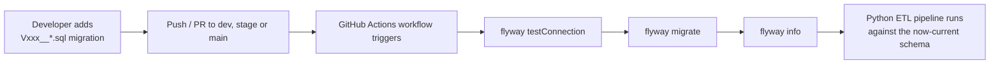

# TMDB ETL Pipeline

An end-to-end **ETL (Extract, Transform, Load)** pipeline that pulls movie data from
the [TMDB (The Movie Database) API](https://www.themoviedb.org/documentation/api),
validates and transforms it, and loads it into a **PostgreSQL** data warehouse. Database
schema/version control is managed with **Flyway**, and the whole pipeline is automated
through a **GitHub Actions** CI/CD workflow running on a self-hosted Windows runner.

---

## What is this project about?

This project simulates a real-world **data engineering pipeline**:

1. **Extract**: Fetch movie details from the TMDB public API.
2. **Validate**: Ensure the payload has all required fields before processing.
3. **Transform**: Normalize the raw JSON response into a clean, warehouse-ready structure.
4. **Load**: Persist the raw payload and the transformed record into PostgreSQL via a stored procedure.
5. **Track**: Every run is recorded in an `ingestion.pipeline_run` audit table with a status (`RUNNING`, `COMPLETED`, `FAILED`).

Database objects (schemas, tables, stored procedures) are never created manually.
They are version-controlled as SQL migration scripts and applied automatically by
**Flyway** as part of the CI/CD pipeline. This keeps `dev`, `stage`, and `prod`
environments consistent and auditable.

---

## Project Structure & File Responsibilities

```
tmdb-etl/
├── .github/workflows/
│   └── tmdb-pipeline.yml        # GitHub Actions CI/CD pipeline definition
├── config/
│   ├── dev.env                  # Dev environment secrets/config (DB + TMDB token)
│   ├── stage.env                # Stage environment secrets/config
│   └── prod.env                 # Prod environment secrets/config
├── flyway.toml                  # Flyway project config (schemas, environments, locations)
├── flyway.user.toml             # Local/user-specific Flyway overrides (not committed with secrets)
├── flyway/
│   ├── conf/                    # Environment-specific Flyway CLI configs (dev/stage/prod)
│   └── sql/
│       ├── schemas/             # Creates the ingestion/tmdb/audit/reporting schemas
│       ├── tables/               # Versioned table migrations (movies, genres, ratings, etc.)
│       └── procedures/          # Stored procedures (e.g. sp_load_movie) + seed data
├── orchestrator/
│   ├── api_extractor.py         # EXTRACT: calls TMDB API, handles retries & auth headers
│   ├── validator.py             # VALIDATE: checks required fields exist on the payload
│   ├── transformer.py           # TRANSFORM: maps raw TMDB JSON to the DB schema shape
│   ├── db.py                    # DB connection helper (reads config/<env>.env via psycopg2)
│   └── run_pipeline.py          # ORCHESTRATES the full run: extract -> validate -> transform -> load
├── tests/
│   ├── test_api.py              # Tests for the TMDB extractor
│   ├── test_connection.py       # Tests for the DB connection layer
│   ├── test_transformer.py      # Tests for the transformation logic
│   └── test_validator.py        # Tests for payload validation
├── migrations/                  # Currently empty/unused
├── schema-model/                # Flyway Desktop / schema model snapshot for drift detection
├── filter.rgf                   # Redgate Compare filter file (used for schema comparisons)
└── requirements.txt              # Python dependencies
```

### File-by-file breakdown

| File / Folder | Purpose |
|---|---|
| `orchestrator/api_extractor.py` | Extract layer. Loads the right `config/<env>.env`, builds the `Authorization: Bearer` header from `TMDB_ACCESS_TOKEN`, and calls the TMDB `/movie/{id}` endpoint with retry logic. |
| `orchestrator/validator.py` | Guards against incomplete API responses: fails fast if `id`, `title`, `release_date`, or `vote_average` are missing. |
| `orchestrator/transformer.py` | Pure mapping function: raw TMDB JSON to a flat dict matching the `tmdb` schema's movie table columns. |
| `orchestrator/db.py` | Central place for the PostgreSQL connection (`psycopg2`), reading `DB_HOST/DB_PORT/DB_NAME/DB_USER/DB_PASSWORD` from the environment. |
| `orchestrator/run_pipeline.py` | Entry point (`python -m orchestrator.run_pipeline --movie-id <id>`). Creates a `pipeline_run` audit row, runs extract → validate → transform, stores the raw payload, calls the `sp_load_movie` stored procedure, and marks the run `COMPLETED`/`FAILED`. |
| `config/*.env` | Per-environment secrets: DB credentials and the TMDB API token. Selected at runtime via the `APP_ENV` variable (`dev`, `stage`, `prod`). |
| `flyway.toml` | Flyway's main config: declares the schemas to manage, the migration script locations, and one `[environments.<name>]` block per environment (dev/stage/prod), each pointing at a different database URL. |
| `flyway/sql/schemas/` | Creates the four logical schemas: `ingestion` (pipeline audit tables), `tmdb` (core movie data), `audit`, and `reporting`. |
| `flyway/sql/tables/` | Numbered, immutable migration scripts (`V002__...`, `V003__...`, etc.) that create/alter tables. Flyway applies these in version order and never re-runs a script once applied. |
| `flyway/sql/procedures/` | Stored procedures (e.g. `sp_load_movie`, which upserts the payload from `ingestion.pipeline_run_payload` into the `tmdb` tables) and seed data (e.g. registering the `TMDB Movies` pipeline in `pipeline_config`). |
| `.github/workflows/tmdb-pipeline.yml` | The CI/CD definition. See [Flyway in CI/CD](#how-flyway-fits-into-the-picture) and [Example Workflow](#example-end-to-end-workflow) below. |
| `tests/` | Pytest unit tests for each orchestrator module, run automatically before any DB/ETL step in CI. |

---

## How Flyway fits into the picture

Flyway is the **database version control** layer of this project: think of it as
"Git for your database schema."

- Every schema change (new table, new column, new stored procedure) is written as a
  **SQL migration file** under `flyway/sql/**`, named with a strict `V<version>__description.sql`
  pattern (e.g. `V0011__create_movie_flop.sql`).
- Flyway keeps a `flyway_schema_history` table inside the database that tracks which
  migrations have already been applied, so re-running `migrate` is always safe and idempotent.
- `flyway.toml` maps environment names (`dev`, `stage`, `prod`) to their JDBC URLs and
  target schemas, so the **same migration scripts** are promoted through every environment
  in the same order, with no manual "run this SQL by hand in prod" step.
- In CI/CD, the workflow:
  1. Runs `flyway testConnection` to confirm the target DB is reachable.
  2. Runs `flyway migrate` to apply any pending versioned scripts.
  3. Runs `flyway info` to print the resulting migration status for visibility in the logs.
- Because migrations are ordered and checked into Git, **schema changes are code-reviewed,
  versioned, and reproducible**, exactly the same way application code is.



---

## Example end-to-end workflow

Here's what happens when a developer adds a new migration and pushes to `dev`:

1. **Local change**: A developer creates
   `flyway/sql/tables/V0012__add_movie_language_column.sql` and tests it locally with
   `flyway -configFiles=flyway/conf/flyway-dev.conf migrate`.
2. **Commit & push**: Changes are committed and pushed to the `dev` branch (or opened as a PR).
3. **GitHub Actions triggers** (`.github/workflows/tmdb-pipeline.yml`), and because it's the
   `dev` branch, the `dev` GitHub Environment (and its secrets) is selected automatically.
4. **Pipeline steps run in order:**
   - Checkout code, show deployment context (branch/env), verify Python, install
     dependencies from `requirements.txt`.
   - `pytest -v` runs all unit tests in `tests/`. The pipeline stops here if any test fails.
   - `flyway -v` confirms the CLI is installed on the self-hosted runner.
   - DB config secrets (`DB_HOST`, `DB_PORT`, etc.) are validated as present.
   - `flyway testConnection` confirms the `dev` database is reachable.
   - `flyway migrate` applies `V0012__add_movie_language_column.sql` (and any other
     pending scripts) to the `dev` database.
   - `flyway info` prints the full migration history/status.
   - TMDB secret and connectivity are verified (both from PowerShell and Python).
   - `python -m orchestrator.run_pipeline --movie-id 603` runs the actual ETL: extracts
     movie 603 from TMDB, validates it, transforms it, and loads it, now able to use
     the new `language` column because the schema is already up to date.
   - Logs are uploaded as a build artifact regardless of success/failure.
5. **Result**: If everything passes, the `dev` database schema and the `tmdb` movie
   data are both updated in a single, auditable run. The same workflow promotes to
   `stage` (on push to `stage`) and `prod` (on push to `main`), using each environment's
   own secrets and database.

---

## Future Scope

- [ ] **Change traceability**: Require every commit/migration script to reference an
      associated **Jira Task / User Story / Bug** (e.g. enforced via a commit-message
      hook or PR template) so every schema or pipeline change is traceable to a tracked
      work item.
- [ ] **Review & approval gate**: Introduce a mandatory **review & approval step**
      (e.g. GitHub Environment protection rules / required reviewers) before any
      migration or pipeline run is allowed to execute against `stage` or `prod`.

---

## Running Tests Locally

```powershell
python -m pip install -r requirements.txt
python -m pytest -v
```

## Running the ETL Locally

```powershell
$env:APP_ENV = "dev"
python -m orchestrator.run_pipeline --movie-id 603
```
